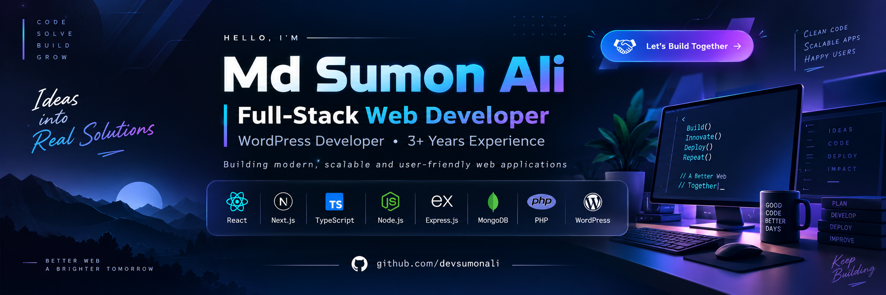

<!--- banner --->

 

<!--- title --->

  <ul align="center">
    
<h1 style="display: inline-block">Hi 👋, I'm Md Sumon Ali Akondo</h1>

  

  </ul>

 

<!--- about --->
- 👋 Hi, I’m **[@devsumonali](https://github.com/devsumonali)**
- 🖥️ I work with **React.js, Next.js, TypeScript, JavaScript and Tailwind CSS** for frontend development.
- 🗄️ I use **Node.js, Express.js, MongoDB, Mongoose and MySQL** for backend development.
- 🌐 I have **3+ years of professional WordPress development experience**.
- 🧩 I work with **WordPress, WooCommerce, Elementor, Crocoblock, JetEngine, ACF and Custom PHP**.
- ⚙️ I build **Full-Stack Applications, Business Websites, eCommerce Stores, Booking Systems, LMS Platforms and Custom Web Solutions**.
- 🚀 I focus on **fast, scalable, responsive and user-friendly web applications**.
- 💬 Ask me about **Full-Stack Development, React, Next.js, Node.js, Express.js, MongoDB and WordPress**.
- 🌐 Explore my portfolio: **[devsumon](https://devsumon.com/)**
- 📫 Feel free to reach me by **Email**
  
 

<!--- socials --->
## <b> FOLLOW ME ON SOCIALS:</b>

  

  

  

  

  

  

 

<!--- technology --->
## <b> TECHNOLOGY STACK:</b>

### Languages:

### CSS Frameworks & Libraries:

### JavaScript Frameworks & Libraries:

### Database & Model:

### WordPress & CMS:

  

### WordPress Ecosystem:

  
  
  
  

  <strong>Crocoblock</strong> •
  <strong>JetEngine</strong> •
  <strong>JetFormBuilder</strong> •
  <strong>ACF</strong>

### Deployment Platform:

### Design & Graphics:

### Tools & Technologies:

 

<!--- wordpress experience --->
## 🧩 <b>WORDPRESS EXPERIENCE:</b>

I have **3+ years of professional experience** working with WordPress and building websites for different industries and business needs.

### My WordPress Expertise:

- Custom WordPress Development
- Elementor & Elementor Pro
- WooCommerce Development
- Crocoblock
- Custom Post Types
- Dynamic Content
- Custom PHP Functionality
- Payment Gateway Integration
- Website Speed Optimization
- Schema Markup
- GA4 & Google Tag Manager
- Server-Side Tracking

 

<!--- featured projects --->
## 🚀 <b>FEATURED PROJECTS:</b>

### DevStack
A modern web application built with React, TypeScript and Tailwind CSS.

**Tech Stack:** React, TypeScript, Tailwind CSS
🌐 https://dev-stack-project-iota.vercel.app/

---

### Scuba Divings
A dynamic WooCommerce website with custom functionality and performance-focused development.

**Tech Stack:** WordPress, WooCommerce, Elementor, Crocoblock, PHP

🌐 https://scubadivings.us

---

### Techila
A modern business website built with Elementor and JetEngine.

**Tech Stack:** WordPress, Elementor, JetEngine

🌐 https://techila.com.au

---

### Sentinel Stack
A modern landing page focused on responsiveness and conversion.

🌐 https://sentinelstack.us

 

<!--- statistics --->
## <b> GITHUB STATISTICS & ANALYSIS:</b>

### GitHub Contributions:

<picture>
  <source
    media="(prefers-color-scheme: dark)"
    srcset="https://raw.githubusercontent.com/devsumonali/devsumonali/output/github-snake-dark.svg"
  />
  <source
    media="(prefers-color-scheme: light)"
    srcset="https://raw.githubusercontent.com/devsumonali/devsumonali/output/github-snake.svg"
  />
  
</picture>

 

### GitHub Profile Details:

  

 

### GitHub Statistics:

  

 

### Most Used Languages:

  

 

### Productive Time:

  

 

### GitHub Streak:

  

 

<!--- random quote --->
## <b> RANDOM DEV QUOTE:</b>

  

 

---

<!--- visit count --->

  

